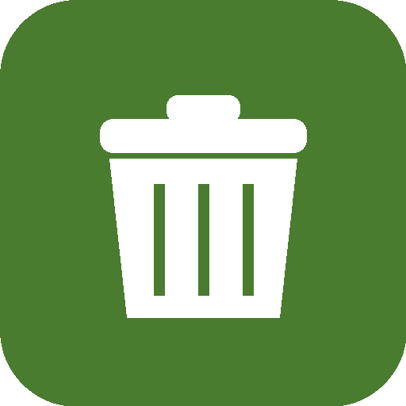

#  Skart Malta

A Home Assistant custom integration (installable via [HACS](https://hacs.xyz)) that tracks Malta's national door-to-door waste collection schedule, including glass collection days.

> **Skart** is Maltese for *waste / rubbish*.

> 🧩 **Companion card:** for a clean dashboard display, install the matching Lovelace card from
> **[ha-skart-malta-card](https://github.com/beta-j/ha-skart-malta-card)**. The integration provides the sensors; the card displays them.

## The schedule

Malta's weekday collection schedule has been standardised nationally since 2 January 2023, so it is the same in every locality:

| Day       | Collection                |
|-----------|---------------------------|
| Monday    | Organic (white bag)       |
| Tuesday   | Mixed (black bag)         |
| Wednesday | Organic (white bag)       |
| Thursday  | Recyclable (grey/green)   |
| Friday    | Organic (white bag)       |
| Saturday  | Mixed (black bag)         |
| Sunday    | No collection             |

Glass is collected on configurable Fridays of the month (default: 1st and 3rd).

## Installation (HACS)

1. In HACS, open the **⋮** menu → **Custom repositories**.
2. Add `https://github.com/beta-j/ha-skart-malta` with category **Integration**.
3. Install **Skart Malta** and restart Home Assistant.
4. Go to **Settings → Devices & Services → Add Integration → Skart Malta**.
5. Set a name, your local collection time, and the glass schedule.

## Entities created

- `sensor.skart_malta_today` — streams collected today
- `sensor.skart_malta_tomorrow` — streams collected tomorrow
- `sensor.skart_malta_next_glass_collection` — date of next glass day
- `binary_sensor.skart_malta_glass_day_today` — on when glass is collected today

Each day sensor exposes `streams`, `date`, and `is_glass_day` attributes, which the companion card reads.

## Configuration options

After setup, click **Configure** on the integration to change:

- **Collection time** — your locality's collection time (stored for display / automations).
- **Glass collection day** — defaults to Friday, configurable.
- **Glass collection weeks of the month** — defaults to 1st and 3rd.

## Notes

- Collection *day* is national; only the *time* varies by locality, so time is stored for your reference and for building notification automations.
- This is an unofficial project and is not affiliated with WasteServ, any local council, or the Government of Malta.

## License

MIT
